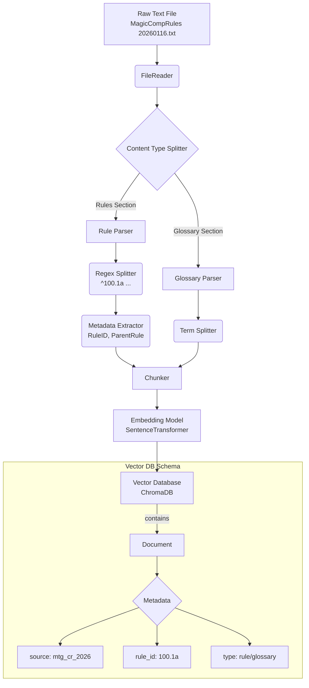

# MTG Rules Ingestion Pipeline Design

This document outlines the design for the ingestion pipeline of the Magic: The Gathering Comprehensive Rules.

## Architecture Overview

The pipeline transforms the raw text file (`MagicCompRules.txt`) into a queryable Vector Database, preserving the structure of the rules (Rule Numbers, Glossary, etc.) to enable precise semantic search and citation.

## Processing Flow

## detailed Components

### 1. File Reader
- **Input**: `references/MagicCompRules 20260116.txt`
- **Action**: Reads the file line-by-line or as a full text block. Handle `utf-8` encoding.

### 2. Content Type Splitter
The Comprehensive Rules file generally has three main sections:
1.  **Introduction/Contents**: Valid but low value for rules queries.
2.  **Rules (100-900)**: The core mechanics.
3.  **Glossary**: Definitions of keywords.

### 3. Rule Parser
Instead of generic paragraph splitting, we use the predictable structure of MTG rules.
- **Regex**: `^(\d{3}\.[\d]+[a-z]?)\s+(.*)`
    - Captures the Rule ID (e.g., `702.19b`).
    - Captures the Rule Text.
- **Hierarchy**:
    - **Header Rules** (e.g., `100. General`): Treat as context or separate high-level chunks.
    - **Sub-rules** (e.g., `100.1a`): The atomic unit of retrieval.

### 4. Embedding
- **Model**: `BAAI/bge-large-en-v1.5` or `sentence-transformers/all-mpnet-base-v2`.
- **Strategy**: Embed the *text*, potentially prepended with the *Rule ID* to strengthen exact match queries (e.g., "What is rule 702.19?").

### 5. Storage (ChromaDB)
- **Collection Name**: `mtg_rules_v2` (versioned to allow rebuilding).
- **ID Strategy**: Use the Rule Number as the Document ID (e.g., `rule_702.19b`) to prevent duplicates and allow direct lookups.
